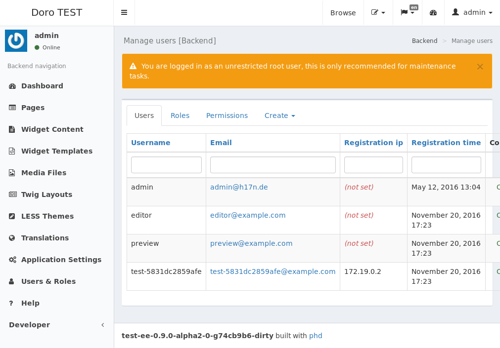
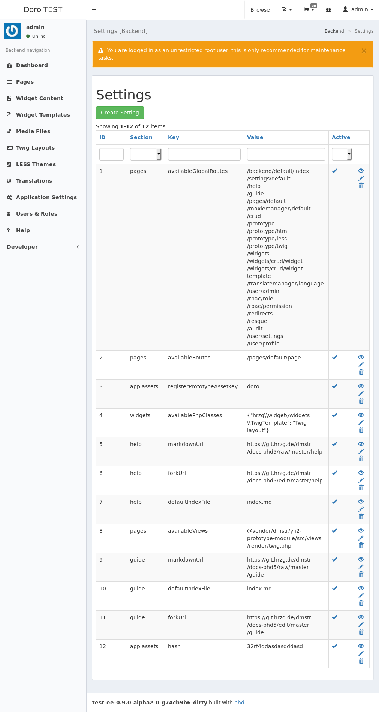

## :construction_worker: Initial backend setup with `admin` user

## Accessing the application backend

After starting the application stack and opening it in your browser, you can access the web-application backend via `/backend`.

Login with `admin` / `admin1` and change the admin password.

### :construction_worker: Create users and assign roles

- `/user`

User (Role)

- admin (Admin)
- dev (Developer)
- editor (Editor)
- preview (Frontend)

> :bulb: The user `admin` is very similar to a root-user, by default it has every permission, or speaking in Yii terms `can()` always returns `true`.

### Create media files

- Application URL: `/filefly`
- Permission: `FileflyApi` (Role)

Folders

- `/public`
  - set read permissions to `Public`
- `/dumps`

### :construction_worker: Activate prototyping asset bundle

- `/settings`

- `@hrzg/widget/views/test/triple.twig`

Logout as admin.

## General information

You will find the current application identifier (`APP_NAME`) and version in the footer of the backend.

##

----

