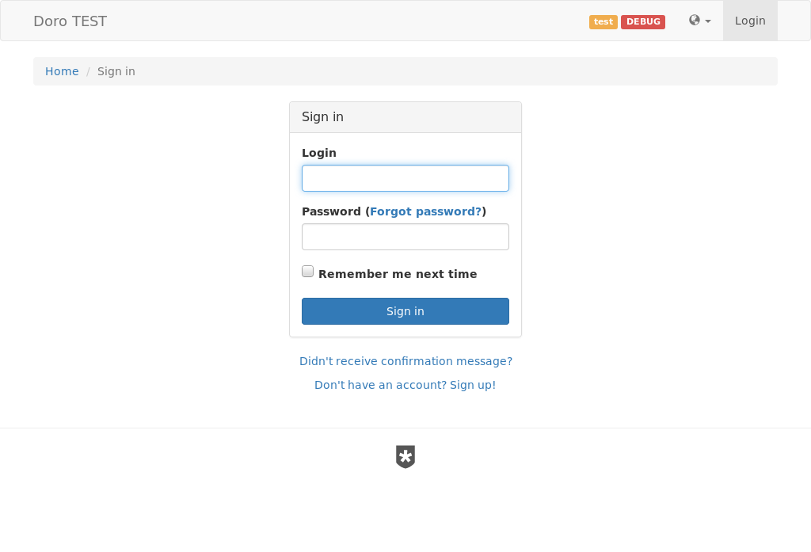
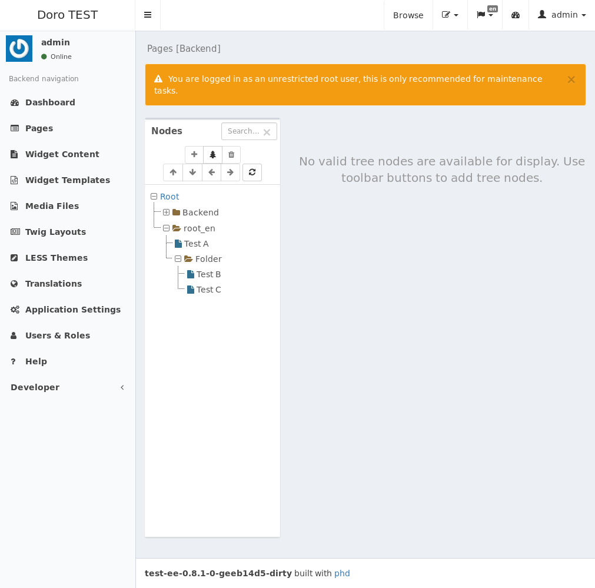

Tutorial
========

## Editor

## Accessing the application backend

After starting the application stack and opening it in your browser, you can access the web-application backend via `/backend`.

Login with `admin` / `admin1` and change the admin password.

### Create users and assign roles

- admin
- dev (Developer)
- editor (Editor)
- preview (Frontend)

> Note: The user `admin` is very similar to a root-user, by default it has every permission, or speaking in Yii terms `can()` always returns `true`.

### Create sitemap with the `pages` module

- `/pages`

## Choose a theme for content prototyping

see also https://github.com/twbs/bootstrap/blob/master/less/variables.less

### Add basic layout Twigs

see also Examples

## Add content through widgets

- Widgets, Editor
  - Tipps & Tricks
  - https://git.hrzg.de/hrzg/yii2-widgets2-module

---

## Developer

### Templates 

## Translations

- Übersetzungen

